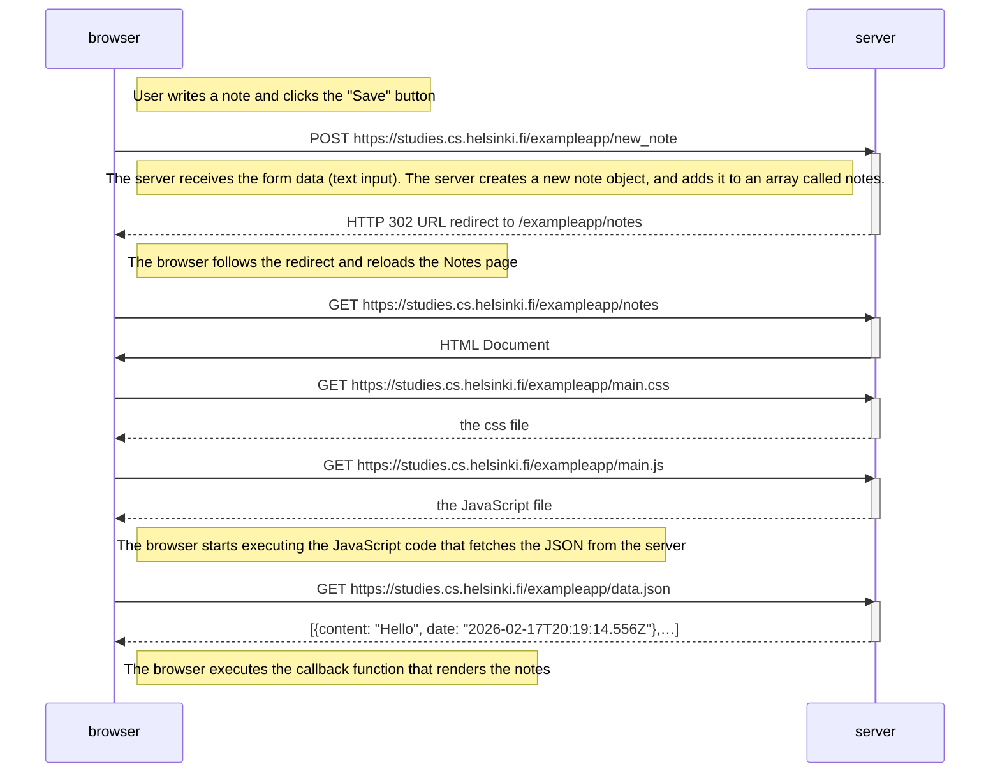
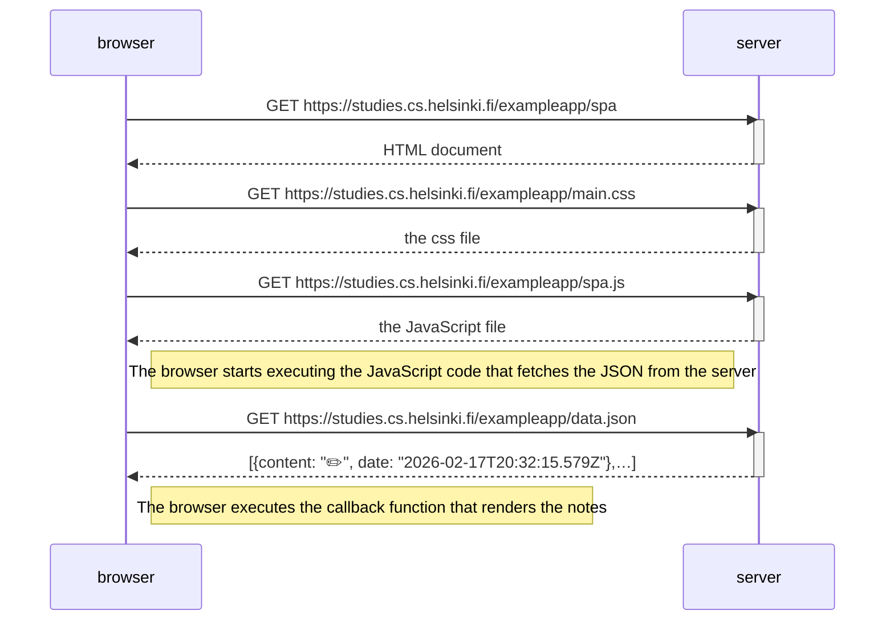
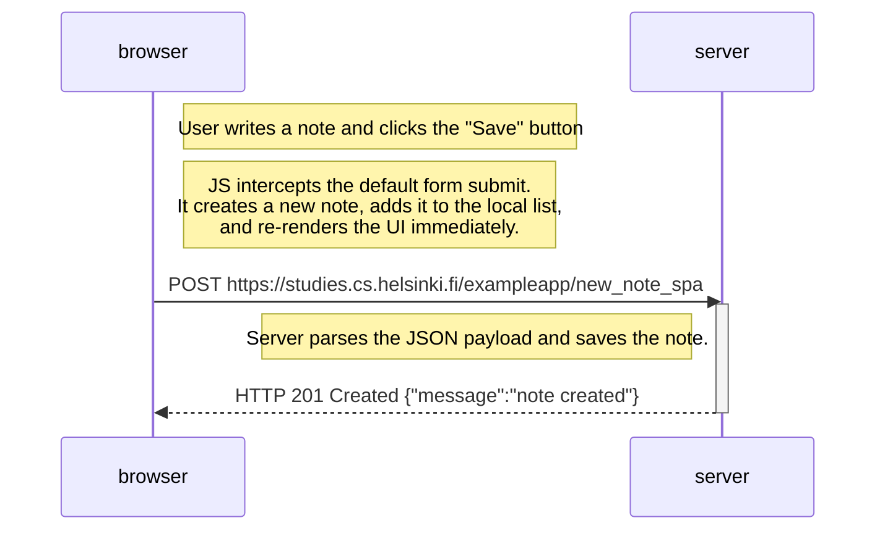

# Exercise 0.4-6
Sequence Diagrams to depict the chain of events caused

## Excercise 0.4
Where the user creates a new note on the page https://studies.cs.helsinki.fi/exampleapp/notes

## Exercise 0.5
where the user goes to the single-page app version of the notes app at https://studies.cs.helsinki.fi/exampleapp/spa.

## Exercise 0.6
where the user creates a new note using the single-page version of the app.

