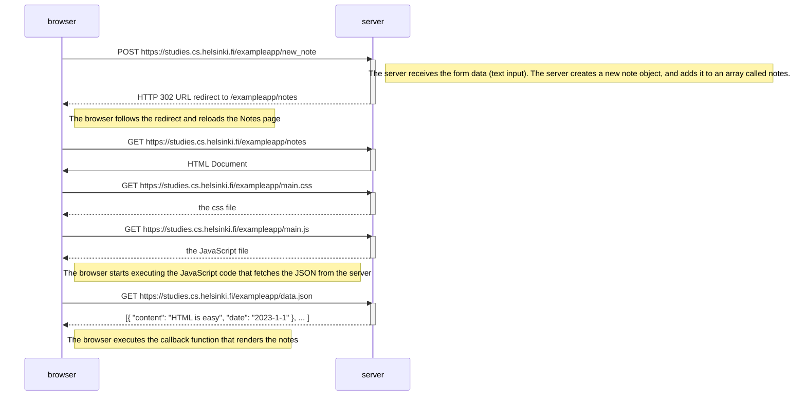

# Exercise 0.4-6
Sequence Diagrams to depict the chain of events caused

## Excercise 0.4
Where the user creates a new note on the page https://studies.cs.helsinki.fi/exampleapp/notes

```mermaid
sequenceDiagram
    participant browser
    participant server
    
    browser->>server: POST https://studies.cs.helsinki.fi/exampleapp/new_note
    activate server
    Note right of server: The server receives the form data (text input). The server creates a new note object, and adds it to an array called notes.
    server-->>browser: HTTP 302 URL redirect to /exampleapp/notes
    deactivate server

    Note right of browser: The browser follows the redirect and reloads the Notes page

    browser->>server: GET https://studies.cs.helsinki.fi/exampleapp/notes
    activate server
    server->>browser:HTML Document
    deactivate server

    browser->>server: GET https://studies.cs.helsinki.fi/exampleapp/main.css
    activate server
    server-->>browser: the css file
    deactivate server

    browser->>server: GET https://studies.cs.helsinki.fi/exampleapp/main.js
    activate server
    server-->>browser: the JavaScript file
    deactivate server

    Note right of browser: The browser starts executing the JavaScript code that fetches the JSON from the server

    browser->>server: GET https://studies.cs.helsinki.fi/exampleapp/data.json
    activate server
    server-->>browser: [{ "content": "HTML is easy", "date": "2023-1-1" }, ... ]
    deactivate server

    Note right of browser: The browser executes the callback function that renders the notes
```
